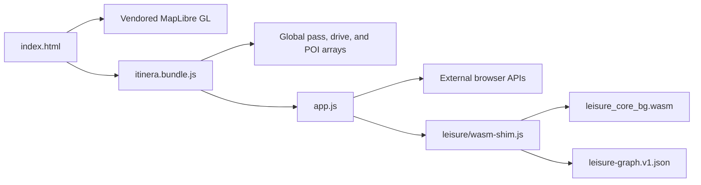

# Repository baseline audit

## Scope and evidence

This audit retains the original pre-redesign inspection from **2026-07-25** at Git commit `5bd7636bbdca09bce6a5b36f5825cd7a331da9de` (`chore(poi-prices): refresh cache from Wikidata`, committed 2026-07-23). Measurements below describe that original commit unless a section is explicitly labelled “redesign branch”.

Before making the current architecture and data-governance decisions, latest `main` was re-inspected on **2026-07-26** at `5aad075f92d2b452160a18382375d314677a2b6f` (`Remove ChatGPT Sites configuration`, committed 2026-07-26). That revision already contained the first canonical nature platform, regional loader, routing boundary, Rust/WASM planner, deterministic bundle/site build, tests, and documentation; it deliberately removed `.openai/hosting.json`, so this work preserves local deterministic packaging without claiming or creating a hosted deployment.

The audit is structural, not a claim that every runtime path, external service, data record, licence, or jurisdiction was independently verified. In particular, record counts measure checked-in inventory; they do not establish geographic, thematic, legal-access, or route completeness.

Useful reproduction commands from the repository root are:

```sh
git rev-parse HEAD
git ls-files | wc -l
wc -l -c assets/js/app.js assets/js/itinera.bundle.js assets/data/leisure-graph.v1.json
stat -c '%s %n' assets/wasm/leisure-core/leisure_core_bg.wasm
du -sb --exclude=.git --exclude=target --exclude=node_modules . assets assets/ui-icons
```

The `stat` and `du` syntax shown is for GNU userland. PowerShell contributors can use `Get-Item` and `Get-ChildItem` equivalents.

## Baseline shape

The application is a client-rendered static site. `index.html` loads vendored MapLibre GL, one stylesheet, and a generated JavaScript bundle. `tools/build-bundle.mjs` concatenates 15 ordered JavaScript sources: 14 global data/support files followed by `assets/js/app.js`. This order is a runtime contract because `app.js` consumes globals created by the preceding files.

The planner has two related but distinct paths:

- legacy JavaScript performs map interaction, filtering, direct road-routing calls, weather lookup, geocoding, Wikipedia enrichment, and local persistence;
- `crates/leisure-core` implements the leisure-route optimizer in Rust, compiled to WebAssembly and reached through `assets/js/leisure/wasm-shim.js`, with `assets/data/leisure-graph.v1.json` as its graph artifact.

The browser is therefore simultaneously the UI, application coordinator, data host, cache, third-party API client, and part of the routing layer. There was no first-party server application or deployment workflow in the inspected commit.



## Baseline measurements

| Artifact or inventory | Measured value | Interpretation |
| --- | ---: | --- |
| Tracked files | 388 | Includes application, data, generated assets, tests, and tooling. |
| `assets/js/app.js` | 11,378 lines; 464,442 bytes | A large, stateful coordinator with many responsibilities. |
| `assets/js/itinera.bundle.js` | 2,369,929 bytes | Unminified concatenated application and data bundle. |
| `assets/data/leisure-graph.v1.json` | 2,989,132 bytes | One-line JSON graph fetched by the leisure planner. |
| `assets/wasm/leisure-core/leisure_core_bg.wasm` | 969,295 bytes | Committed optimized WebAssembly artifact. |
| Working tree excluding `.git`, `target`, and `node_modules` | approximately 91 MiB | Dominated by static assets. |
| `assets/` | approximately 76 MiB | Application data, JS, media, vendor code, and WASM. |
| `assets/ui-icons/` | approximately 62 MiB | Source and normalized icon assets dominate repository bytes, not necessarily initial transfer bytes. |

The byte totals are uncompressed filesystem sizes. They are not Core Web Vitals, transfer sizes, parse times, or memory measurements.

## What the baseline does well

- MapLibre is vendored and version-pinned, avoiding a runtime package-manager dependency for the map engine.
- The JS bundle and WASM shim use content hashes, and CI verifies that committed generated artifacts remain in sync.
- The Rust planner has substantial unit and integration coverage, including graph invariants, optimizer behavior, performance-oriented tests, and JS/WASM API parity.
- The UI already includes labels, keyboard-reachable native controls, `aria-live` status regions, reduced-detail alternatives for some interactions, and explicit geolocation error handling.
- Legacy records retain useful editorial descriptions, local-language Wikipedia hints, road context, sightseeing categories, and a meaningful Scotland inventory.

These strengths are migration assets. They do not remove the limitations below.

## Principal limitations

### Data model and coverage

The checked-in arrays are editorial inventories optimized around mountain passes, scenic drives, and sightseeing. They are not jurisdiction inventories. Most hike-like POIs are points rather than route geometries. Pass points and scenic-drive waypoints do not prove current access, lawful stopping, route continuity, or navigability. IDs and compact field names are tied to file order and legacy conventions, and per-field provenance is generally unavailable.

There was no canonical representation for route stages, variants, trail segments, trailheads, parking constraints, transit/ferry/cable links, permits, restrictions, hazards, sensitive-location policy, or source assertions. Local difficulty scales and uncertainty were not preserved systematically.

### Application coupling

`assets/js/app.js` combines map rendering, custom WebGL overlays, clustering/deconfliction, UI state, planner orchestration, network calls, persistence, and presentation. Many functions share mutable module-global state and DOM IDs. The generated bundle embeds the country arrays, so a data change rebuilds and invalidates the application bundle.

The custom overlay and marker-deconfliction paths deserve targeted profiling. Several passes walk or sort visible feature collections; scale cannot be inferred from today’s curated record count.

### Routing and external services

The legacy browser code calls the public OSRM demonstration service directly for driving routes and matrices and caches responses in `localStorage`. It also calls Open-Meteo, a configured geocoder, Wikipedia, map styles/tiles, and image hosts from the browser. Availability, rate limits, privacy behavior, terms, and response shape are therefore external runtime dependencies.

The public OSRM demo is not a production service-level dependency and supports only the legacy driving use case here. There is no isolated first-party profile boundary for walking or hiking, no secret-safe proxy, and no reliable multimodal timetable engine in the baseline.

### Delivery and operations

The inspected repository had test and WASM-verification GitHub Actions workflows but no deployment workflow, release manifest, rollback procedure, operational dashboard, or data-refresh orchestration. Static hosting is simple, but correctness currently depends on a coordinated set of HTML, bundle, graph, WASM, and external-service versions.

There is no service worker or documented offline contract. `localStorage` caches are best-effort and are not a durable offline data store.

### Safety, governance, and accessibility

The baseline user interface can show status and seasonal estimates, but the data model cannot consistently distinguish official verification from inference or unknown. A missing closure, permit, parking, transport, hazard, or legal-access fact must never be interpreted as favorable.

Repository licensing does not by itself establish redistribution rights for every imported database fact, image, description, or selection. Legacy Wikimedia links and mixed OSM/manual records require item- or source-level review.

Native controls provide a useful accessibility base, but the map remains visually dense and interaction-heavy. A complete audit still needs keyboard-only journey planning, screen-reader reading order, focus restoration for overlays/dialogs, zoom/reflow, contrast, motion, non-map result parity, and status/error announcements tested in supported browsers.

## Redesign branch observed after the baseline

The redesign branch retains the versioned canonical schema, registries, isolated ingestion/build pipeline, discovery scoring, mixed-mode itinerary composition, same-origin routing boundary, routing worker, Rust/WASM planner, fixtures, and Node tests. It adds content-addressed fixed zoom-8 spatial cells as the default visible-map data path while retaining byte-bounded regional packages for user-activated search across all advertised records in a selected delivery partition. `index.html` presents Discover by default, provides synchronized textual/map results, renders uncertainty and route/access geometry, and retains the legacy Plan and Browse paths. A deterministic site packager emits an allowlisted `dist/client`, the worker at `dist/server/index.js`, and a hashed build manifest; CI rebuilds/diffs generated artifacts and exercises that package.

That implementation is a scalable migration foundation, not delivered
territorial coverage. Deterministic release build `502fbdf646728ce8` contains
two approved NPS records: one complete Harding Icefield route and one access
point. It emits one 236,785-byte regional package, a 514-byte spatial index,
and one 236,806-byte spatial-cell package. The 1,374-byte manifest hash-binds
an exact 3,478-byte source-release notice. All three adapters still process
3,992 legacy migrations, two NPS outputs, and 25 non-superseded canonical seeds
for drift auditing, but public governance withholds the 4,017 records that
reference non-approved sources and removes all 1,436 uncleared media items.

Those are pipeline and release-governance results, not evidence of territorial
completeness. Across 206 jurisdiction registry entries, overall statuses remain
authored as 190 **Unknown** and 16 **Excluded, with reason**; none is
**Verified broad coverage** or **Verified partial coverage**. Scotland is
structurally modeled and source-researched but has no approved public record.
Routing upstreams are unconfigured, there is no scheduled nature refresh, and
no route or release has field safety certification. The retained legacy bundle
also lies outside the exact nature source-release notice. See [Performance](../performance.md) and [Coverage matrix](../data/coverage-matrix.md).

## Migration constraints

The redesign should preserve user-visible legacy planning while progressively replacing implicit globals with versioned contracts. The following invariants are non-negotiable:

1. Existing pass, POI, scenic-drive, graph, and WASM identities need redirects or compatibility adapters during migration.
2. Stored established-route geometry must never be silently replaced by a generated connector or scenic overview.
3. Unknown access, safety, schedule, permit, sensitivity, or licence state must remain unknown and visible.
4. Browser code must not receive upstream secrets.
5. Data releases must preserve source assertions, licences, attribution, assessment dates, and quality flags.
6. Coverage status is authored from evidence; imports and record counts cannot upgrade it automatically.
7. The map must have a usable non-map discovery and itinerary representation.

## Audit boundary

This audit did not certify third-party licences, inspect live upstream responses, validate every legacy coordinate, run an assistive-technology conformance test, benchmark representative devices, penetration-test a deployment, or prove route safety. Those remain release work, not implied outcomes of the architecture migration.
