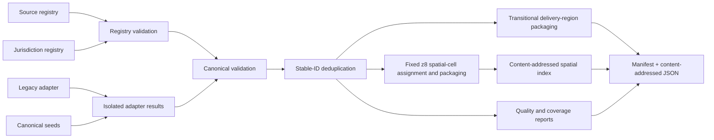

# Nature data ingestion and delivery

## Current pipeline

`tools/nature/build.mjs` is a deterministic local builder for canonical nature packages. Today it has two default adapters:

1. `legacy-repository`, which reads the checked-in pass, POI, and scenic-drive JavaScript arrays;
2. `canonical-seeds`, which reads `data/seeds/nature-routes.v1.json`.

No registered official-source downloader, incremental refresh scheduler, database, or production snapshot store exists yet. Entries such as OSM, government portals, transit feeds, and protected-area sources in `data/sources/registry.v1.json` are researched source definitions, not proof they are ingested.



Run it from the repository root with:

```sh
npm run build:nature
```

The `build:nature` package script invokes the deterministic nature builder, and CI rebuilds the generated artifacts to verify that they match the commit.

## Inputs and contracts

### Source registry

`data/sources/registry.v1.json` describes exact publishers/products, retrieval and snapshot policy, licence, attribution, authentication, rate limits, schema assumptions, known gaps, failure behavior, last refresh, and redistribution status. `schemas/source-registry.schema.json` is the declarative contract; the builder also enforces required fields, `secretBrowserSafe: false`, isolated failure behavior, and unique source IDs.

A registry entry is not publication approval. The lifecycle states documented in [Data source policy](data/source-policy.md) are governance states; the current registry schema does not yet persist a `lifecycle` field. An approved `lead_only` extraction mode permits only independently authored minimal lead metadata; it never permits copying source text, geometry, or media.

### Jurisdiction registry

`data/jurisdictions/registry.v1.json` defines the territorial inventory, parent relationship, in-scope decision, source/coverage profiles, authored overall status, and caveats. The build report copies the authored status and profile dimensions. It never upgrades coverage from record counts.

The executable registry validator currently checks root version/list shape, row ID/name/kind/boolean `inScope`, and duplicate IDs. Review still has to verify parent references, profile references, source profiles, territorial scope, and coverage vocabulary consistency.

### Canonical entities

`schemas/nature-domain.schema.json` and `assets/js/nature/domain.mjs` define schema version `1.0.0`. The executable validator requires stable ID, entity type, jurisdiction IDs, localized names, GeoJSON geometry, source assertions, quality, and sensitivity. It adds entity-specific rules for routes, access points, and transport connections.

The JSON Schema is useful for tooling, but the build currently calls the executable validator directly rather than a JSON Schema engine. Both contracts must change together.

## Adapter contract and isolation

An adapter returns:

```js
{
  adapterId: "stable-adapter-id",
  records: [/* canonical entities */],
  redirects: { /* old ID to canonical ID */ },
  inventories: [/* source file/snapshot counts */]
}
```

`runIsolatedAdapters` executes adapters separately and records typed failure summaries. If at least one succeeds, remaining records can be built; if all fail, the builder refuses to replace output. This is mechanical failure isolation only. The current builder does **not** enforce registry `criticality`, `serveLastKnownGood`, freshness, licence disposition, or source lifecycle. A production promotion gate must add those decisions.

Adapters should write no shared mutable state and should never make one source’s failure delete another accepted snapshot. Network acquisition and raw validation belong in source-specific staging before canonical merge.

## Legacy normalization

The legacy adapter extracts known assigned arrays without executing the source files. It maps:

- pass points to `NaturalFeature` plus available gateway `AccessPoint` records;
- curated POIs to `Place`, `NaturalFeature`, or `ProtectedArea`, with parking as a separate `AccessPoint`;
- scenic drives to `TrailRoute` with `routeNature: scenic_drive`, `geometryCompleteness: overview_only`, and `navigationSuitability: false`.

It preserves the compact source record, original path/ordinal, legacy redirect, and uncertainty flags. Hike-required POIs remain points with `route_geometry_missing`; the adapter does not fabricate hiking lines. Legal access generally remains unknown.

This adapter is a migration bridge. Mixed/unclear source and media rights, incomplete lineage, and stale operational facts prevent treating its output as verified coverage.

## IDs, merge, and duplicates

`stableId` creates readable IDs with a deterministic FNV-1a suffix from namespace/source identity. It is a stability helper, not a content hash or security primitive. Adapters should prefer durable publisher identifiers over labels or array positions.

The builder deduplicates exact IDs. Two byte-canonically identical records collapse; conflicting records with one ID fail the build. It does not perform field-level source reconciliation.

The quality report identifies limited near-duplicate candidates: point entities with the same entity type and lowercased primary name within 250 m. That heuristic does not normalize every spelling/language case and does not merge records. Review must resolve aliases, colocated features, translated names, and conflicting geometries explicitly.

## Validation and fail-closed rules

The build checks source and jurisdiction references after entity validation. Unless `allowInvalid` is explicitly passed through the programmatic API, any canonical validation error removes staging and fails publication.

Important semantic rules include:

- longitude/latitude order and finite valid bounds;
- at least one primary localized name, without normalized duplicates in one language;
- at least one source assertion with evidence and verification state;
- complete line geometry for established routes;
- explicit `navigationSuitability`;
- explicit access modes and legal state for routes/access points;
- transport mode and at least two endpoint IDs;
- sensitivity action and quality assessment.

Validation does not prove source truth, geometry alignment, route continuity on the ground, legal access, schedule operation, accessibility, safety, or licence compatibility.

## Generated outputs

A successful build replaces `assets/data/nature/` outputs with:

- `manifest.v1.json` — transitional regional package references, the spatial-index reference, hashes, byte sizes, counts, and authored budgets;
- `packages/<region>/<hash-prefix>.json` — transitional deterministic, byte-bounded shards of canonical regional entities plus full SHA-256;
- `spatial/index/<hash-prefix>.json` — the separate content-addressed index of populated fixed Web Mercator XYZ zoom-8 cells and their package references;
- `spatial/cells/8/<x>/<y>/<hash-prefix>.json` — deterministic, content-addressed spatial-cell package shards;
- `quality-report.v1.json` — validation, flags, missing attribution/access summaries, duplicate candidates, and adapter failures;
- `coverage-report.v1.json` — authored jurisdiction coverage with processed inventory counts;
- `sensitivity-report.v1.json` — sensitivity delivery actions, publication counts, and withheld/coarsened identity checks;
- `ingestion-report.v1.json` — adapter results and inventories;
- `legacy-id-redirects.v1.json` — old-to-canonical identity mapping.

The builder writes a local `.staging` tree, then copies reports, regional packages, and spatial artifacts into the output. This protects against validation failure before replacement, but the final copy is not an atomic hosting release. Deployment must promote a complete release directory or equivalent version as one unit.

Within each delivery region, entities are sorted by ID and greedily divided into the largest deterministic prefixes that fit `regionalPackageBytes`. Every artifact declares zero-based `shardIndex` and common `shardCount`; the builder fails if any shard or single entity exceeds the limit. These packages remain the current UI delivery path during transition: the browser loads a region only after explicit user activation.

The parallel spatial layout uses fixed Web Mercator XYZ cells at zoom 8. A point belongs to one cell. Line and polygon geometries are copied into the cells of their minimal antimeridian-aware bounding box; the builder fails rather than fan one entity out to more than 4,096 cells. This assignment preserves complete canonical geometry and therefore can duplicate an entity across cells. Each cell is deterministically sharded to the 1,000,000-byte `spatialCellPackageBytes` budget. The separate index is capped by the 2,000,000-byte `spatialIndexBytes` budget and is referenced from the manifest by content-addressed URL, exact byte count, and SHA-256.

The browser's spatial API validates index and cell URL shape, advertised decoded byte count, canonical hash, schema/artifact identity, zoom, cell identity, and shard identity/count before accepting data. `loadViewport` treats `west > east` as a dateline-crossing viewport, defaults to at most 64 cells and 128 packages per call, deduplicates canonical IDs, and retains at most 128 verified cells in a least-recently-used cache. The current Discover UI does not yet use this call by default; it remains on explicit regional loading while the spatial path is measured and integrated.

Content hashes cover canonical, recursively key-sorted JSON cores. Hash validation detects corruption/mismatch; it does not establish publisher authenticity by itself because the manifest, index, and packages are served from the same trust origin.

Regional and spatial package trees currently contain duplicate delivery representations of the same canonical records. That transitional storage and any extra cross-cell line/polygon copies must be included in release-footprint, CDN, build-time, and browser-performance measurements; package budgets alone do not demonstrate efficient viewport delivery.

The current 4,019-record generated corpus measures processed inventory only. It is not verified geographic, thematic, access, or route completeness, regardless of package layout or cell coverage.

## Hike detail and export safety

`TrailRoute` fields feed a readable detail view with five sections: At a glance, Route character, Getting there, Safety & conditions, and Data confidence. Missing distance, ascent/descent, duration, difficulty, terrain, season, hazards, current conditions, and legal access are stated as unknown rather than inferred.

Export is deliberately asymmetric. Any route with a valid `LineString` or `MultiLineString` can be exported as GeoJSON, but the file labels geometry representation/completeness, navigation suitability, provenance, and the safety disclaimer. GPX additionally requires `geometryCompleteness: "complete"` and `navigationSuitability: true`; invalid line geometry is rejected in both formats. All 38 current `TrailRoute` records are unverified and navigation-unsuitable, so GPX is unavailable for every current route. Neither schema validation, a rendered line, nor either export format is field-safety certification.

## Source acquisition design

A production source adapter should follow these phases:

1. **Discover and approve** the exact product, publisher, version, terms, territory, and purpose.
2. **Acquire** with a source-specific user agent, bounded retries/timeouts, rate-limit respect, and server-side secret handling.
3. **Snapshot** immutable raw bytes or the approved hash/request/response metadata required by the registry policy.
4. **Inspect** encoding, CRS/axis order, schema, IDs, nulls, dates, subdivisions, out-of-scope records, topology, and upstream changes.
5. **Normalize** without discarding original names, classification, grade, identifiers, time fields, or geometry.
6. **Assert** provenance at the narrowest practical JSON Pointer/field, including source record and retrieval/effective dates.
7. **Protect** sensitive locations before any public/debug export.
8. **Reconcile** conflicting assertions without destructive source precedence.
9. **Qualify** confidence, verification, freshness, access, geometry, and known gaps.
10. **Promote** only after licence, attribution, quality, coverage, and performance gates pass.

Use bulk/versioned sources for large ingestion. Do not use public Nominatim, Overpass, tile, SPARQL, or routing demonstration endpoints as unbounded production backends.

## Dynamic data

Closures, fire, flood, avalanche, volcano, tide, weather, permits, prices, and transport schedules need their own refresh and expiry lifecycles. Store issued/observed/retrieved/valid-from/valid-until timestamps and affected geometry. On failure, mark safety-critical state unknown or unavailable; do not relabel stale data as current.

The current package build is static and does not implement these refresh lifecycles. The itinerary code can enforce modeled conditions and refuse critical unknowns, but only supplied, fresh records can activate those protections.

## Verification commands

For a nature-data change:

```sh
node --check tools/nature/build.mjs
node --check tools/nature/lib/legacy-adapter.mjs
node tools/nature/build.mjs
node --test tests/nature-*.test.mjs
npm test
```

For changes that touch the legacy planner, bundle, Rust/WASM graph, or shim, also run the relevant full gates:

```sh
npm run build:bundle
git diff --exit-code -- assets/js/itinera.bundle.js index.html
cargo fmt --package leisure-core -- --check
cargo build --package leisure-core
cargo test --package leisure-core --tests
npm run verify:wasm-hash
npm run check:wasm-size
```

After every build, inspect the generated quality, ingestion, coverage, and manifest reports. A zero validation-error count is not a release approval and a non-zero record count is not coverage.
