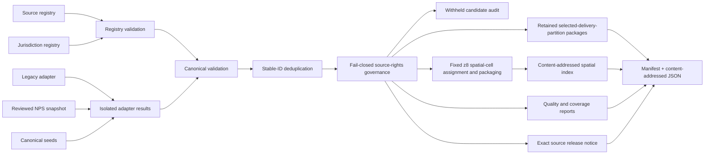

# Nature data ingestion and delivery

## Current pipeline

`tools/nature/build.mjs` is a deterministic local builder for canonical nature packages. Today it has three default adapters:

1. `legacy-repository`, which reads the checked-in pass, POI, and scenic-drive JavaScript arrays;
2. `nps-public-trails`, which reads one hash-pinned, reviewed National Park Service trail snapshot and its query/rights metadata;
3. `canonical-seeds`, which reads `data/seeds/nature-routes.v1.json` after removing the two seed records superseded by the NPS adapter.

The default release build processes all three adapters before applying fail-closed source-rights governance. In the current build that means 3,992 legacy records, 2 NPS records, and 25 non-superseded canonical seeds: 4,019 candidates. Governance withholds all 4,017 candidates that reference unapproved sources, so the public nature packages contain only the two governed NPS records. Candidate inventory is not public corpus or coverage.

The NPS adapter consumes checked-in governed evidence; it is not a live downloader. No incremental refresh scheduler, database, or production snapshot store exists yet. Other entries such as OSM, government portals, transit feeds, and protected-area sources in `data/sources/registry.v1.json` remain researched source definitions unless a generated ingestion report names an accepted snapshot. Registry presence alone is not proof of ingestion or publication permission.



Run it from the repository root with:

```sh
npm run build:nature
```

The `build:nature` package script invokes the deterministic nature builder, and CI rebuilds the generated artifacts to verify that they match the commit.

For an offline candidate audit only, an isolated disposable checkout may run:

```sh
node tools/nature/build.mjs --include-unapproved-previews
```

This mode is explicitly non-release. It produces a source release notice with `releaseEligible: false`, must never be passed to `npm run build:site` or promoted, and must be followed by a clean default build before any release review. The flag exposes withheld candidates for audit; it does not grant rights or turn them into a public corpus.

## Inputs and contracts

### Source registry

`data/sources/registry.v1.json` describes exact publishers/products, retrieval and snapshot policy, licence, attribution, authentication, rate limits, schema assumptions, known gaps, failure behavior, last refresh, publication disposition, approved uses, per-source rights cost, and redistribution status. `schemas/source-registry.schema.json` is the declarative contract; the builder also enforces required fields, `secretBrowserSafe: false`, isolated failure behavior, unique source IDs, approved/no-fee publication rules, and fail-closed record/media governance.

A registry entry is not publication approval. The persisted `publicationDisposition` values are `approved`, `lead_only`, `link_only`, and `blocked`, and `approvedUses` is purpose-specific. `lead_only` permits only independently authored minimal lead metadata; it never permits copying source text, exact third-party geometry, or media, and it never upgrades the lead to a verified or worthwhile recommendation.

### Jurisdiction registry

`data/jurisdictions/registry.v1.json` defines the territorial inventory, parent relationship, in-scope decision, source/coverage profiles, authored overall status, and caveats. The build report copies the authored status and profile dimensions. It never upgrades coverage from record counts.

The executable registry validator currently checks root version/list shape, row ID/name/kind/boolean `inScope`, and duplicate IDs. Review still has to verify parent references, profile references, source profiles, territorial scope, and coverage vocabulary consistency.

### Canonical entities

`schemas/nature-domain.schema.json` and `assets/js/nature/domain.mjs` define schema version `1.0.0`. The executable validator requires stable ID, entity type, jurisdiction IDs, localized names, GeoJSON geometry, source assertions, quality, and sensitivity. It adds entity-specific rules for routes, access points, and transport connections.

The JSON Schema is useful for tooling, but the build currently calls the executable validator directly rather than a JSON Schema engine. Both contracts must change together.

## Adapter contract and isolation

An adapter returns:

```js
{
  adapterId: "stable-adapter-id",
  records: [/* canonical entities */],
  redirects: { /* old ID to canonical ID */ },
  inventories: [/* source file/snapshot counts */]
}
```

`runIsolatedAdapters` executes adapters separately and records typed failure summaries. If at least one succeeds, its records can enter candidate validation; if all fail, the builder refuses to replace output. This is mechanical failure isolation only: adapter success never implies delivery. The default release build separately enforces publication disposition, approved use, no-fee rights cost, unverified lead labeling, and per-file media clearance, withholding every record that references an unapproved source. It still does **not** execute source acquisition, enforce refresh schedules, or turn registry `criticality`, `serveLastKnownGood`, and freshness into a complete production promotion workflow; operations must add those lifecycle decisions.

Adapters should write no shared mutable state and should never make one source’s failure delete another accepted snapshot. Network acquisition and raw validation belong in source-specific staging before canonical merge.

## Reviewed NPS snapshot adapter

`nps-public-trails` is approved only for the reviewed NPS-authored Public Trails Geographic records and dated factual visitor guidance represented by the checked-in Harding Icefield files. The GeoJSON snapshot was retrieved at `2026-07-26T15:10:00Z`, is pinned by SHA-256 `659b79588e3e8038051b172b6668e71e7ee4bce0706c005545ccf966349b3fd1`, and records the canonical ArcGIS query for OBJECTIDs `30488`, `30504`, `31241`, `29918`, `31691`, and `29968`. Snapshot metadata also records the reviewed segment order, source IDs, retrieval times, visitor/access guidance URLs, and rights scope.

The adapter requires exactly those six unrestricted, public-display, existing hiking segments, checks field values and topology, joins them in the reviewed order without simplifying coordinates, and reverses the joined outbound line to form one complete out-and-back. It emits exactly two verified records: `route:us-ak-harding-icefield-out-and-back` and `access:us-ak-exit-glacier-trailhead`. Those records replace same-ID canonical seeds; they do not coexist as competing claims. Geometry survey dates, current-condition caveats, parking unknowns, transformations, source assertions, and complete per-record export notices remain explicit.

Approval is narrow. It covers structured original U.S. Government trail geometry and factual visitor guidance for `discovery`, `fact_evidence`, `bulk_ingest`, and `geometry`, with NPS attribution and the recorded 17 U.S.C. 105/disclaimer notice. It excludes NPS marks and logos, photographs, audiovisual media, and separately credited third-party material. The separate `nps-data-api` registry entry remains `lead_only`; its API key, mixed content, and media are not approved by this snapshot. Public visibility, `DATAACCESS=Unrestricted`, or `PUBLICDISPLAY=Public Map Display` is not a general permission for another NPS product, release, feature, or asset. Any expansion requires product-level rights review, a retained query/snapshot/hash, field and topology drift review, and a new promotion decision.

These two verified records are a governed pilot, not United States, Alaska, NPS-network, access, condition, or safety coverage. The static snapshot is not a live closure or condition feed.

## Legacy normalization

The legacy adapter extracts known assigned arrays without executing the source files. It maps:

- pass points to `NaturalFeature` plus available gateway `AccessPoint` records;
- curated POIs to `Place`, `NaturalFeature`, or `ProtectedArea`, with parking as a separate `AccessPoint`;
- scenic drives to `TrailRoute` with `routeNature: scenic_drive`, `geometryCompleteness: overview_only`, and `navigationSuitability: false`.

It preserves the compact source record, original path/ordinal, legacy redirect, and uncertainty flags. Hike-required POIs remain points with `route_geometry_missing`; the adapter does not fabricate hiking lines. Legal access generally remains unknown.

This adapter is a migration bridge. Mixed/unclear source and media rights, incomplete lineage, and stale operational facts prevent treating its output as verified coverage.

## IDs, merge, and duplicates

`stableId` creates readable IDs with a deterministic FNV-1a suffix from namespace/source identity. It is a stability helper, not a content hash or security primitive. Adapters should prefer durable publisher identifiers over labels or array positions.

The builder deduplicates exact IDs. Two byte-canonically identical records collapse; conflicting records with one ID fail the build. It does not perform field-level source reconciliation.

The quality report identifies limited near-duplicate candidates: point entities with the same entity type and lowercased primary name within 250 m. That heuristic does not normalize every spelling/language case and does not merge records. Review must resolve aliases, colocated features, translated names, and conflicting geometries explicitly.

## Validation and fail-closed rules

The build checks source and jurisdiction references after entity validation. Unless `allowInvalid` is explicitly passed through the programmatic API, any canonical validation error removes staging and fails publication.

Important semantic rules include:

- longitude/latitude order and finite valid bounds;
- at least one primary localized name, without normalized duplicates in one language;
- at least one source assertion with evidence and verification state;
- complete line geometry for established routes;
- explicit `navigationSuitability`;
- explicit access modes and legal state for routes/access points;
- transport mode and exactly two distinct, non-empty endpoint IDs;
- sensitivity action and quality assessment.

Validation does not prove source truth, geometry alignment, route continuity on the ground, legal access, schedule operation, accessibility, safety, or licence compatibility.

## Generated outputs

A successful build replaces `assets/data/nature/` outputs with:

- `manifest.v1.json` — retained selected-delivery-partition package references, the spatial-index and source-release-notice references, hashes, byte sizes, counts, and authored budgets;
- `source-release-notice.v1.json` — the exact approved-source and per-file media-rights closure for delivered records, its counts, and an explicit `releaseEligible` decision; the manifest binds its URL, decoded bytes, and SHA-256;
- `packages/<region>/<hash-prefix>.json` — deterministic, byte-bounded shards retained for explicit search across all advertised records in a selected delivery partition and user-activated compatibility use, plus full SHA-256;
- `spatial/index/<hash-prefix>.json` — the separate content-addressed index of populated fixed Web Mercator XYZ zoom-8 cells and their package references;
- `spatial/cells/8/<x>/<y>/<hash-prefix>.json` — deterministic, content-addressed spatial-cell package shards;
- `quality-report.v1.json` — validation, flags, missing attribution/access summaries, duplicate candidates, and adapter failures;
- `coverage-report.v1.json` — authored jurisdiction coverage with processed inventory counts;
- `sensitivity-report.v1.json` — sensitivity delivery actions, publication counts, and withheld/coarsened identity checks;
- `ingestion-report.v1.json` — adapter results and inventories;
- `legacy-id-redirects.v1.json` — old-to-canonical identity mapping.

The builder writes a local `.staging` tree, then copies reports, the source release notice, regional packages, and spatial artifacts into the output. This protects against validation failure before replacement, but the final copy is not an atomic hosting release. Deployment must promote a complete release directory or equivalent version as one unit.

Before promotion, review must prove that `source-release-notice.v1.json` is the exact closure of approved source assertions and cleared per-file media referenced by every delivered record, that its URL/decoded bytes/SHA-256 match the manifest reference, and that `releaseEligible` is `true`. A missing, stale, mismatched, or `releaseEligible: false` notice is an absolute release blocker. The notice is generated evidence for this exact nature build, not a reusable blanket permission.

Within each delivery region, entities are sorted by ID and greedily divided into the largest deterministic prefixes that fit `regionalPackageBytes`. Every artifact declares zero-based `shardIndex` and common `shardCount`; the builder fails if any shard or single entity exceeds the limit. The browser loads these packages only after explicit region activation to search all advertised records in that selected delivery partition; after a viewport failure they remain available only through that user action.

The parallel spatial layout uses fixed Web Mercator XYZ cells at zoom 8. A point belongs to one cell. Line and polygon geometries are copied into the cells of their minimal antimeridian-aware bounding box; the builder fails rather than fan one entity out to more than 4,096 cells. This assignment preserves complete canonical geometry and therefore can duplicate an entity across cells. Each cell is deterministically sharded to the 1,000,000-byte `spatialCellPackageBytes` budget. The separate index is capped by the 2,000,000-byte `spatialIndexBytes` budget and is referenced from the manifest by content-addressed URL, exact byte count, and SHA-256.

The browser validates index and cell URL shape, advertised decoded byte count, canonical hash, schema/artifact identity, zoom, cell identity, and shard identity/count before accepting data. `loadViewport` treats `west > east` as a dateline-crossing viewport, defaults to at most 64 cells, 128 packages, and 8,000,000 raw package bytes per call, deduplicates canonical IDs, and retains at most 128 verified cells in a least-recently-used cache. A loader-wide queue starts no more than six spatial-cell jobs at once. Concurrent callers share a cell job; aborting one caller detaches only that subscription, while queued jobs with no subscribers are removed and running orphaned jobs are aborted. Package shards within one cell job are fetched sequentially; failed or aborted jobs are not cached, so later requests can retry cleanly. Discover uses this path for visible-map data: map attachment schedules an initial viewport load and `moveend` schedules subsequent loads. An over-broad, superseded, or failed viewport is not silently partial; the UI asks the user to zoom or explicitly activate a delivery partition.

Content hashes cover canonical, recursively key-sorted JSON cores. Hash validation detects corruption/mismatch; it does not establish publisher authenticity by itself because the manifest, index, and packages are served from the same trust origin.

Regional and spatial package trees contain duplicate delivery representations of the same canonical records because they serve visible-map viewport loading and explicit selected-delivery-partition retrieval respectively. That retained storage and any extra cross-cell line/polygon copies must be included in release-footprint, CDN, build-time, and browser-performance measurements; package budgets alone do not demonstrate efficient viewport delivery.

Default release build `502fbdf646728ce8` processes 4,019 candidates from three successful adapters: 3,992 legacy, 2 NPS, and 25 non-superseded canonical-seed records. Fail-closed rights governance withholds all 4,017 records that reference unapproved sources. Public delivery therefore contains exactly two NPS records in one regional package (236,785 bytes) and one zoom-8 cell package (236,806 bytes), with a 1,374-byte manifest and a 514-byte spatial index. Fixed initial nature data is only manifest plus index, 1,888 raw bytes; the authored request upper bound is 8,001,888 raw bytes. The complete generated nature tree is 10 files totaling 651,524 bytes. There is no public Alpine or Scotland nature package in this release. These measurements describe one governed pilot, not geographic, thematic, access, route, condition, or safety coverage.

## Hike detail and export safety

`TrailRoute` fields feed a readable detail view with five sections: At a glance, Route character, Getting there, Safety & conditions, and Data confidence. Missing distance, ascent/descent, duration, difficulty, terrain, season, hazards, current conditions, and legal access are stated as unknown rather than inferred.

Both route formats fail closed unless `exportMetadata.sourceNotices` contains one complete publisher, product, licence/version/URL, attribution, source URL, and transformation notice for every distinct asserted source record. The current public nature corpus contains exactly one `TrailRoute`, Harding Icefield Trail, and its one associated access point. Harding passes both the GeoJSON and stricter GPX gates. GPX additionally requires complete, publish-safe, non-reduced line geometry, `navigationSuitability: true`, verified/current route quality, verified/current geometry assertions, and acceptable access. An offline build with `--include-unapproved-previews` may produce audit counts for other routes, but those candidates are not public and must not be described as the current release corpus. Neither schema validation, a rendered line, nor an available export is field-safety certification; Harding conditions, closures, weather, wildlife, and other hazards still require current local verification.

## Source acquisition design

A production source adapter should follow these phases:

1. **Discover and approve** the exact product, publisher, version, terms, territory, and purpose.
2. **Acquire** with a source-specific user agent, bounded retries/timeouts, rate-limit respect, and server-side secret handling.
3. **Snapshot** immutable raw bytes or the approved hash/request/response metadata required by the registry policy.
4. **Inspect** encoding, CRS/axis order, schema, IDs, nulls, dates, subdivisions, out-of-scope records, topology, and upstream changes.
5. **Normalize** without discarding original names, classification, grade, identifiers, time fields, or geometry.
6. **Assert** provenance at the narrowest practical JSON Pointer/field, including source record and retrieval/effective dates.
7. **Protect** sensitive locations before any public/debug export.
8. **Reconcile** conflicting assertions without destructive source precedence.
9. **Qualify** confidence, verification, freshness, access, geometry, and known gaps.
10. **Promote** only after licence, attribution, quality, coverage, and performance gates pass.

Use bulk/versioned sources for large ingestion. Do not use public Nominatim, Overpass, tile, SPARQL, or routing demonstration endpoints as unbounded production backends.

## Dynamic data

Closures, fire, flood, avalanche, volcano, tide, weather, permits, prices, and transport schedules need their own refresh and expiry lifecycles. Store issued/observed/retrieved/valid-from/valid-until timestamps and affected geometry. On failure, mark safety-critical state unknown or unavailable; do not relabel stale data as current.

The current package build is static and does not implement these refresh lifecycles. The itinerary code can enforce modeled conditions and refuse critical unknowns, but only supplied, fresh records can activate those protections.

## Verification commands

For a nature-data change:

```sh
node --check tools/nature/build.mjs
node --check tools/nature/lib/legacy-adapter.mjs
node --check tools/nature/lib/nps-public-trails-adapter.mjs
node tools/nature/build.mjs # default, release-eligible mode only
node --test tests/nature-*.test.mjs
npm test
```

For changes that touch the legacy planner, bundle, Rust/WASM graph, or shim, also run the relevant full gates:

```sh
npm run build:bundle
git diff --exit-code -- assets/js/itinera.bundle.js index.html
cargo fmt --package leisure-core -- --check
cargo build --package leisure-core
cargo test --package leisure-core --tests
npm run verify:wasm-hash
npm run check:wasm-size
```

After every default build, inspect the generated quality, ingestion, coverage, sensitivity, manifest, and source release notice artifacts. Verify the notice's exact manifest reference and require `releaseEligible: true` before packaging or promotion. Run `--include-unapproved-previews` only in an isolated offline audit workflow, never in the release sequence. A zero validation-error count is not a release approval and a non-zero candidate count is not coverage.
